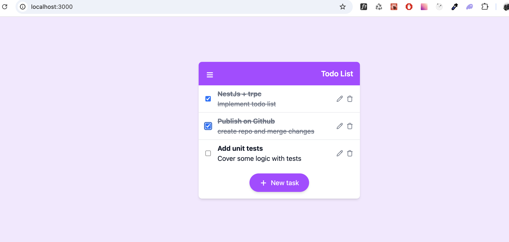

# To Do List App


## 🛠️ Getting Started

```bash
node v 23.11.0
npm v 10.9.2
```

### 1. Clone & Setup Environment

```bash
git clone git@github.com:Nick-bond/next-trpc-app.git
cd next-trpc-app
cp .env-sample .env
```

NOTE you have to configure next variables to be able receive emails

```bash
SMTP_PASSWORD='your_app_password'
SMTP_FROM='your_email@gmail.com'
SMTP_TO='your_email@gmail.com'
```

### How to get app password: 

- Access Your Google Account:
- Start by visiting the Google Account management page. You can do this by navigating to https://myaccount.google.com/.
- Sign In: Sign in to the Google Account associated with the Gmail address you want to use for sending emails programmatically.
- Security: In the left sidebar, click on “Security.”
- Scroll down to How you sign in to google and click on 2-step verificaiton.
- App Passwords: Scroll down to “App passwords.” Click on “App passwords.” You may be prompted to re-enter your password for security purposes.
- App name: Enter a custom name for this App Password. It helps you identify it later, so choose something related to the application or use case where you plan to use this App Password.
- Create: Click the “Create” button. Google will create a unique 16-character App Password for your custom application/device.


Install packages
```bash
npm install
```

run local dev serve

```bash
npm run dev
```

For test

```bash
npm run test
```

## Run in docker

```bash
docker-compose up --build 
```